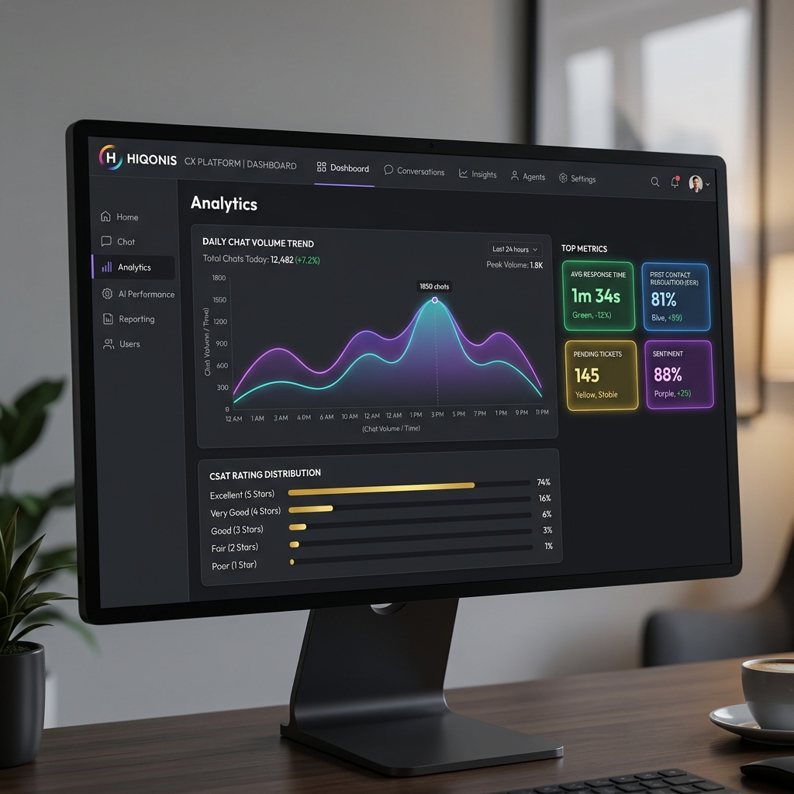
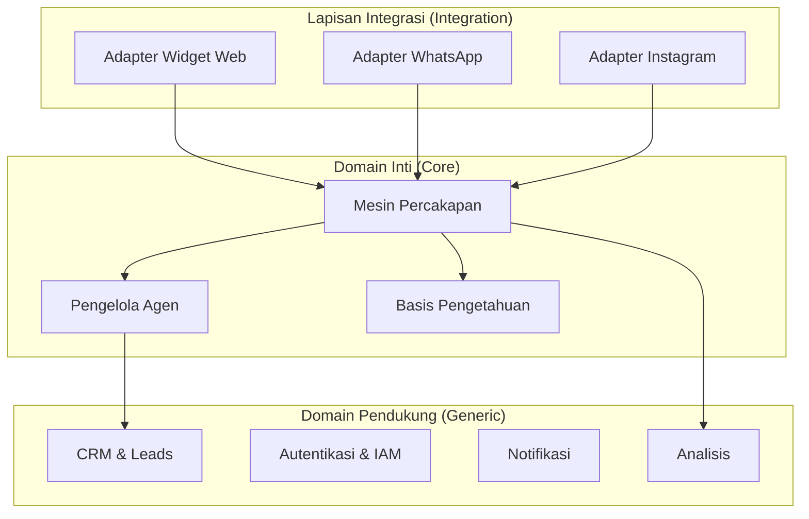
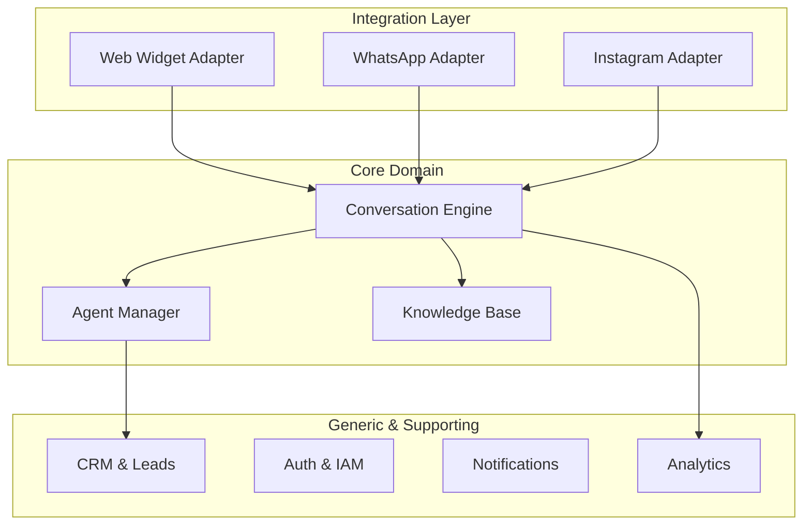

<!-- Ya Allah, Insyaallah Atas Izin Allah Bisnis Ini Sukses Besar dan Berhasil Seperti Sebesar Microsoft dan Google -->

<div align="center">
  
# 🚀 Hiqonis

### Platform AI Agent All-in-One untuk Customer Experience (CX) — Open-Source, Enterprise-Grade, Indonesia-First
### All-in-One AI Agent Platform for Customer Experience (CX) — Open-Source, Enterprise-Grade, Indonesia-First

[](#)
[](#)
[](https://www.gnu.org/licenses/agpl-3.0)
[](https://www.python.org/)
[](https://nextjs.org/)

> ⚠️ **Status Proyek**: **Under Development (Aktif Dikembangkan)** | **Versi Saat Ini**: `v0.01` (Pre-alpha)
>
> ⚠️ **Project Status**: **Under Development** | **Current Version**: `v0.01` (Pre-alpha)



**Hiqonis** adalah platform open-source customer experience (CX) bertenaga AI enterprise-grade terkemuka. Dirancang khusus untuk memotong biaya operasional customer service dengan agen AI otonom yang cerdas, kontekstual, dan mampu menangani percakapan layaknya manusia dalam Bahasa Indonesia dan Inggris.

**Hiqonis** is a leading enterprise-grade open-source customer experience (CX) platform powered by AI. Specially designed to cut customer service operating costs with intelligent, contextual autonomous AI agents capable of handling human-like conversations in Indonesian and English.

[Bahasa Indonesia](#-bahasa-indonesia) • [English](#-english)

</div>

---

## 🇮🇩 Bahasa Indonesia

### ✨ Fitur Utama

- **🤖 AI Chat Agent**: Multi-channel chat dengan reasoning, context-aware, dan natural language processing (didukung Google ADK & LangGraph).
- **📥 Unified Omni-Channel Inbox**: Kelola pesan WhatsApp, Instagram DM, Web Chat Widget, dan Email dalam satu dashboard real-time.
- **📚 Knowledge Base (RAG)**: Unggah dokumen PDF, DOC, atau link website → instan latih AI Agent Anda dengan semantic search pgvector.
- **🤝 Human Agent Takeover**: Transisi mulus antara AI dan Agen manusia ketika percakapan memerlukan penanganan khusus.
- **🛡️ Guardrails & Compliance**: Sistem pencegahan halusinasi AI, proteksi injeksi prompt (OWASP), dan audit logging terintegrasi.
- **🌍 Indonesia-First & Global Ready**: Dukungan multibahasa bawaan (Bahasa Indonesia & English) menggunakan `next-intl`.
- **🔗 Zero Vendor Lock-in**: Integrasi LiteLLM proxy memungkinkan Anda mengganti provider LLM (Gemini, Anthropic, Ollama, OpenAI, OpenRouter, xAI) hanya dalam 1 detik tanpa menyentuh kode aplikasi.
- **💼 AI CRM & Sales Automation**: Kualifikasi lead pintar, visualisasi sales pipeline (Kanban), pembuatan invoice otomatis & konversi PDF ke local storage.
- **📅 Smart Appointment Booking**: Agen AI dapat menjadwalkan janji temu langsung di obrolan dengan kalender terintegrasi yang mendeteksi konflik otomatis.
- **📊 Premium Analytics Dashboard**: Dashboard interaktif bawaan dengan grafik area visual SVG responsif, survey CSAT instan, kalkulator First Response Time (FRT) & Resolution Time, dan ekspor laporan CSV.
- **🎙️ Outbound Voice AI & Premium Gateways**: Dukungan outbound call suara via Vapi, integrasi order/logistik Shopee & Tokopedia, pembayaran otomatis via Midtrans SNAP, dan sinkronisasi ERP (SAP, Oracle).
- **🔒 Enterprise Security & Scalability**: Dukungan Single Sign-On (SSO/SAML), log audit aman, webhook keluar terenkripsi (HMAC-SHA256), pooling koneksi PgBouncer dengan limits 20/10, dan script disaster recovery terintegrasi.

### 🛠️ Tech Stack

| Layer | Teknologi | Justifikasi |
|---|---|---|
| **Backend** | Python 3.12+, FastAPI | Ekosistem AI terbaik, pemrograman asinkron native, dokumentasi OpenAPI otomatis. |
| **Frontend** | Next.js 15+ (App Router), shadcn/ui, Tailwind CSS 4 | Performa rendering server-side kilat, desain antarmuka (UI) ultra-modern. |
| **AI Driver** | Google ADK, LangGraph, LiteLLM Proxy | Orkestrasi multi-agen, alur kerja Graph, gerbang LLM multi-provider. |
| **Database** | PostgreSQL 16+ (pgvector), Redis 7+ | Integritas relasional kuat, pencarian vektor bawaan, caching cepat. |
| **Storage** | MinIO (Self-hosted S3-compatible) | Penyimpanan dokumen basis pengetahuan (knowledge base) dan media. |
| **Real-time** | Socket.io | Sinkronisasi kotak masuk omni-channel secara instan. |

### 🏗️ Arsitektur

Hiqonis dikembangkan dengan arsitektur **Modular Monolith** berbasis **Domain-Driven Design (DDD)** dan **Clean Architecture** untuk efisiensi resource infrastruktur (dapat di-host murah di Hetzner VPS) sekaligus kemudahan scale-out di masa depan.



### 🚀 Mulai Cepat dalam 3 Langkah

#### 1. Jalankan Infrastruktur (Docker)
```bash
docker compose up -d
```

#### 2. Jalankan Backend API
```bash
# Setup python dependencies
uv sync
source .venv/bin/activate

# Jalankan FastAPI server
uv run uvicorn apps.api.main:app --reload --port 8000
```

#### 3. Jalankan Frontend Dashboard
```bash
pnpm install
pnpm --filter web dev
```
Buka dashboard Anda di [http://localhost:3000](http://localhost:3000) dan dokumentasi API di [http://localhost:8000/api/v1/docs](http://localhost:8000/api/v1/docs).

---

## 🇬🇧 English

### ✨ Key Features

- **🤖 AI Chat Agent**: Multi-channel chat powered by reasoning, context-awareness, and natural language processing (backed by Google ADK & LangGraph).
- **📥 Unified Omni-Channel Inbox**: Manage WhatsApp, Instagram DM, Web Chat Widget, and Email conversations from a single real-time dashboard.
- **📚 Knowledge Base (RAG)**: Ingest PDF, DOC, or website URLs → instantly train your AI Agent with pgvector-backed semantic search.
- **🤝 Human Agent Takeover**: Smooth handoffs between AI and human support agents when human touch is required.
- **🛡️ Guardrails & Compliance**: Built-in anti-hallucination guardrails, prompt injection protection (OWASP alignment), and secure audit logging.
- **🌍 Indonesia-First & Global Ready**: Built-in internationalization (Indonesian & English) using `next-intl`.
- **🔗 Zero Vendor Lock-in**: LiteLLM proxy integration allows swapping LLM providers (Gemini, Anthropic, Ollama, OpenAI, OpenRouter, xAI) in 1 second without modifying application code.
- **💼 AI CRM & Sales Automation**: Smart lead qualification, visual sales pipeline (Kanban board), automated invoice generation, and PDF conversion to local storage.
- **📅 Smart Appointment Booking**: AI Agent schedules appointments directly in the chat with integrated conflict-free calendar booking.
- **📊 Premium Analytics Dashboard**: Built-in interactive dashboard with responsive SVG area charts, instant CSAT surveys, First Response Time (FRT) & Resolution Time metrics, and CSV exports.
- **🎙️ Outbound Voice AI & Premium Gateways**: Outbound voice call integration via Vapi, Shopee & Tokopedia order/logistic tracking, automatic billing via Midtrans SNAP, and ERP sync (SAP, Oracle).
- **🔒 Enterprise Security & Scalability**: Single Sign-On (SSO/SAML), cryptographically signed webhooks (HMAC-SHA256), PgBouncer connection pooling (limits 20/10), and disaster recovery tools.

### 🛠️ Tech Stack

| Layer | Technology | Justification |
|---|---|---|
| **Backend** | Python 3.12+, FastAPI | Premiere AI ecosystem, async native, auto OpenAPI docs. |
| **Frontend** | Next.js 15+ (App Router), shadcn/ui, Tailwind CSS 4 | Blazing fast server-side rendering, ultra-modern UI design. |
| **AI Driver** | Google ADK, LangGraph, LiteLLM Proxy | Multi-agent orchestration, Graph workflow, multi-provider LLM gateway. |
| **Database** | PostgreSQL 16+ (pgvector), Redis 7+ | Robust relational integrity, built-in vector search, high-speed caching. |
| **Storage** | MinIO (Self-hosted S3-compatible) | Storage for knowledge base documents and media files. |
| **Real-time** | Socket.io | Instant synchronization of the omni-channel inbox dashboard. |

### 🏗️ Architecture

Hiqonis is developed using a **Modular Monolith** architecture based on **Domain-Driven Design (DDD)** and **Clean Architecture** to ensure infrastructure cost-efficiency (run cheaply on a Hetzner VPS) while allowing straightforward scale-out in the future.



### 🚀 Quick Start in 3 Steps

#### 1. Spin up Infrastructure (Docker)
```bash
docker compose up -d
```

#### 2. Launch Backend API
```bash
# Setup python dependencies
uv sync
source .venv/bin/activate

# Launch FastAPI server
uv run uvicorn apps.api.main:app --reload --port 8000
```

#### 3. Launch Frontend Dashboard
```bash
pnpm install
pnpm --filter web dev
```
Open your dashboard at [http://localhost:3000](http://localhost:3000) and API documentation at [http://localhost:8000/api/v1/docs](http://localhost:8000/api/v1/docs).
